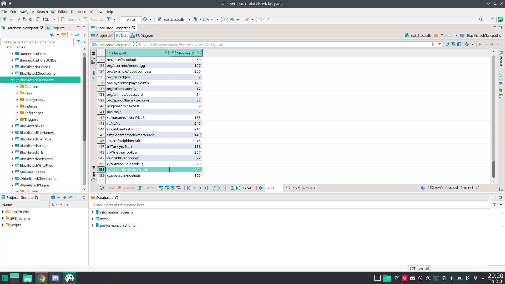
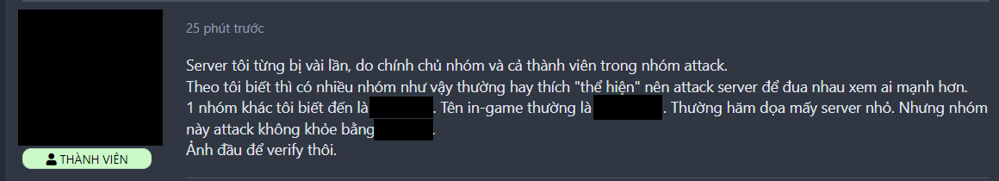
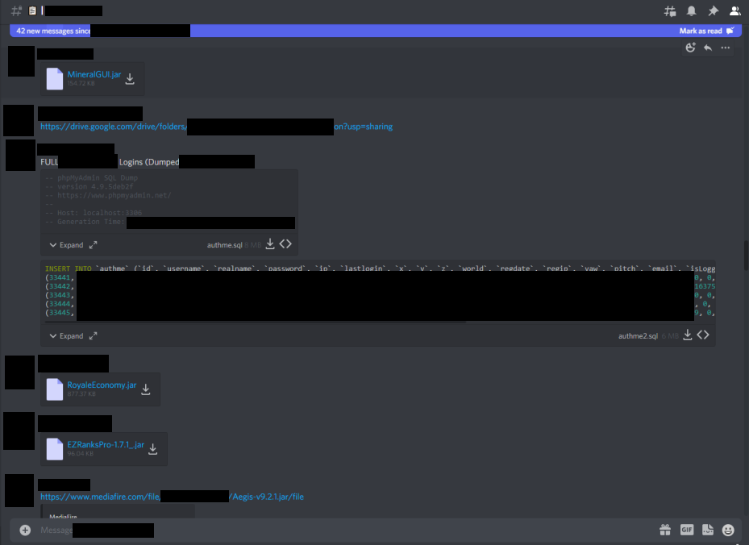
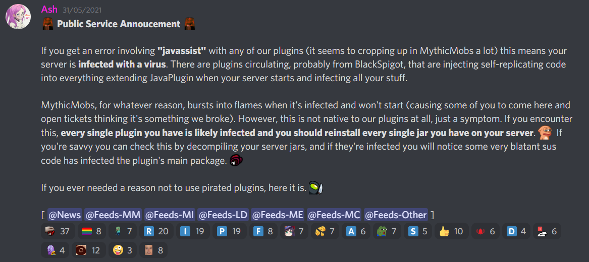
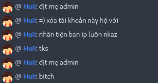

 
# List Of Shame (MCVN Edition)
Danh sách những vật (người, server, dự án hoặc bất cứ thứ gì) gây tranh cãi trong cộng đồng Minecraft Việt Nam

## [ChestCommands](https://dev.bukkit.org/projects/chest-commands)
> Plugin Menu đơn giản nhất cho người mới, nhưng bị giới hạn tính năng

* **Nhiều người vẫn còn dùng để làm menu, nhưng lại chạy bản cũ để hỗ trợ PlayerPoints (và nhiều lỗi hơn)**
* Ai dùng bản mới thì hỏi lên hỏi xuống vì người chơi bug đồ bằng point
* "Code của nó rất khó để mở rộng tính năng" - Tác giả của [BetterGUI](https://www.spigotmc.org/resources/75620/)
* [Bản fork](https://www.spigotmc.org/resources/69014/) đã bị ngừng phát triển nhưng vẫn còn người cố gắng xài (đương nhiên là gặp lỗi)
* Các lựa chọn thay thế: [BetterGUI](https://www.spigotmc.org/resources/75620/), [DeluxeMenus](https://www.spigotmc.org/resources/11734/), [TrMenu](https://github.com/TrMenu/TrMenu/actions),...

## [PlayerPoints](https://dev.bukkit.org/projects/playerpoints)
> Một hệ thống tiền tệ mà nhiều quản lý server Việt Nam sử dụng

* **Bản của Blackixx đã bị dừng phát triển nhưng vẫn có người dùng**
* Các lựa chọn thay thế: [New PlayerPoints](https://www.spigotmc.org/resources/80745/)

## [Multiverse(-Core)](https://www.spigotmc.org/resources/multiverse-core.390/)
> Plugin quản lí nhiều thế giới, nhưng thường chỉ là thế giới spawn và sinh tồn

* **Nhiều bài hướng dẫn làm server khuyên dùng để quản lí world, nên được cho là thừa**
* Lỗi Regex dẫn đến sập server
  * [Minecrash](https://minecraftvn.net/minecrash.t34539/)
  * [Pull Request](https://github.com/Multiverse/Multiverse-Core/pull/2445)
  * Issue: [#2703](https://github.com/Multiverse/Multiverse-Core/issues/2703), [#2704](https://github.com/Multiverse/Multiverse-Core/issues/2704), [#2705](https://github.com/Multiverse/Multiverse-Core/issues/2705)
* Các lựa chọn thay thế: [Rift](https://www.spigotmc.org/resources/rift-world-manager.99359/), [PhantomWorlds](https://www.spigotmc.org/resources/84099/), [Multiverse-Core 4.3.1 trở lên](https://www.spigotmc.org/resources/390/update?update=424085)

## ["Hack OP"](#hack-op)
> Một loại "hack" mà 99% không phải do lỗi server

* **Cho thấy sự thiếu kĩ lưỡng trong việc quản lí bảo mật cho server**
* Đây KHÔNG phải là một loại hack nằm trong một tool hack
* Các hình thức bao gồm
  * Yếu tố phần cứng / phần mềm: dò cổng (port), lợi dụng tường lửa kém, host kém bảo mật
  * Yếu tố con người: mua chuộc, làm phản, lợi dụng sự thiếu hiểu biết của chủ server
* Một số server "chặn" hack này một cách sơ sài bằng cách cài plugin đăng kí/đăng nhập cho tất cả cụm server con
* Một số khác thêm các plugin khá dư thừa (`AntiBungeeHack`, `AntiOP`,...)

## [Backdoor & Malware](#backdoor--malware)
> Đã thuê code còn cài mã độc vào

* **Một cách [Hack OP](#hack-op) cũ, chuyên môn trung bình, nhưng nhắm vào đối tượng ngây thơ và gây thiệt hại lớn**
* Đây là cái quyết định uy tín của người được thuê code
* Đôi lúc, đây cũng là chiêu của những quản trị viên muốn trả thù
* Để tránh bị lộ, một số người còn cho làm [rối code](https://www.google.com/search?q=java+obfuscator) của họ
* Trong một số vụ bóc phốt về Hack OP, những người này cũng có lí lẽ cho hành vi thêm backdoor là "để tránh bị [quỵt](https://vi.wiktionary.org/wiki/%C4%83n_qu%E1%BB%B5t#Ti%E1%BA%BFng_Vi%E1%BB%87t)"
* Ví dụ, có một người có nhiều tiền án về Backdoor, thậm chí có plugin còn được thêm vào danh sách đen của [Spigot Anti-Malware](https://www.spigotmc.org/resources/64982/)

## [DDOS & JoinBot](#ddos--joinbot)
> Thử sức chịu đựng của server, nhưng lại trở thành tool để cạnh tranh không lành mạnh

* **Đang được sử dụng với mục đích xấu**
* Đây là vấn đề không chỉ riêng ở Minecraft, nhưng nó đủ nghiêm trọng vì tình trạng này ở cộng đồng Minecraft là nhiều
* Một số người dùng tool này để tấn công các server mà họ ghét, không quan trọng vì lí do gì
* Một số hội nhóm được lập ra, một số server Discord được lập ra...
  * Họ có các dịch vụ để `thủ nghiệm bảo mật`
  * Chưa thấy dấu hiệu có thể quản lí được mục đích sử dụng của các thành viên đã mua dịch vụ của họ
* Trải lòng của một chủ server

## [Bán tài khoản, vật phẩm dạo](https://minecraftvn.net/members/siocoins.45295/)
> Kiếm tiền lậu bằng công sức của người khác

* **Kiếm tiền bằng cách này thì dùng có kiếm được bao nhiêu thì vẫn chả phải tiền bạn làm ra**
* Bán vật phẩm, Booster của các server lớn (e.g [Hypixel](https://hypixel.net/)) bằng tiền mặt, bất chấp các điều khoản Người Chơi của các server đó
* Nhiều shop bán tài khoản Minecraft mở ra nhưng chỉ duy trì được trong một thời gian ngắn
* Một số shop còn lợi dụng để lừa đảo, chiếm đoạt tiền của người dùng
* [Bàn về tài khoản giá rẻ](https://minecraftvn.net/acc-premium-gia-re-co-nen-mua.t33603/)

## [1.8.x - 1.12.x](https://minecraft.fandom.com/wiki/Java_Edition_version_history)
> Một lựa chọn tốt cho người chơi, nhưng là lựa chọn tệ nhất cho các server

* [Tuổi của 1.8](https://howoldisminecraft188.today/)
* [Tuổi của 1.12.2](https://howoldisminecraft1122.today/)
* Dù vậy, bản 1.13 trở về sau không được đánh giá cao ở hiệu năng khi mã nguồn có nhiều thay đổi gây ảnh hưởng đến hiệu năng (Entity Ticking, Entity Tracker,...)
  * Có thể sử dụng [L-Clearlag](https://www.spigotmc.org/resources/l-clearlag.98464/) để xử lí vấn đề này một phần

## [`offline-mode` Server VS EULA](https://minecraft-mp.com/country/vietnam/)
> Nhiều sự tranh cãi về các server `offline-mode` và [EULA](https://account.mojang.com/documents/minecraft_eula) đối với các server đấy

* **Do tính chất của thị trường Việt Nam, đa số server hiện nay đều là `offline-mode`**
* Vẫn còn sự không rõ ràng trong [EULA](https://account.mojang.com/documents/minecraft_eula) đến các server offline-mode
  * Các server có thể *lách luật* và dẫn đến nhiều chuyện về cách kiếm tiền, trong đó có dạng Pay-To-Win (P2W)
  * Việc kiếm tiền từ server cũng gây tranh cãi vì sẽ còn tuỳ vào độ lớn, nổi tiếng của server và sự sáng tạo của các quản trị viên
* [Phân tích EULA](https://datapools.github.io/MCEula/explanation), không chính thống nhưng có thể tham khảo

## [Tối ưu Server](https://minecraftvn.net/tut-tps.t32218/)
> Thêm nhiều tính năng "độc lạ" và sử dụng các plugin gây lag để 'giảm lag'

### [Yatopia (discontinued)](https://github.com/YatopiaMC/Yatopia)
> The Most Unstable and Glitch Rich Minecraft Server Software
 
  * Chỉ dành cho những người chả hiểu cách mà hệ thống patch hoạt động.
  * Bản fork của Paper với slogan chất nhưng hiệu năng và tính năng đem lại chỉ khiến bạn muốn xóa file server.
  * Xem thêm: [Yaptapia](https://kennytv.github.io/Yaptapia/)
  * Các lựa chọn thay thế: [Paper](https://papermc.io/), [Airplane](https://github.com/Technove/Airplane), [Purpur](https://purpur.pl3x.net/)

### [SugarcaneMC](https://github.com/SugarcaneMC/Sugarcane)
> Tương tự như [Yatopia](#Yatopia-discontinued) nhưng vẫn đang được tiếp tục

### Plugin 'giảm lag' (e.g. [ClearLagg](https://dev.bukkit.org/projects/clearlagg))
> Vô dụng và gây lag nhiều hơn 'giảm lag'

  * Một lựa chọn chấp vá để giải quyết vấn đề về vật phẩm dưới đất và sinh entity: "thay vì sử dụng các tùy chỉnh despawn trong config, sao ta không gom cả đóng entity này vào một tác vụ lớn rồi xóa tất cả mỗi X giây"
  * Spigot đã có tuỳ chọn để [chỉnh thời gian xoá vật phẩm (`item-despawn-rate`)](https://www.spigotmc.org/wiki/spigot-configuration/#:~:text=Controls%20the%20number%20of%20ticks,longer%20until%20they%20de-spawn\).)
  * Các lựa chọn thay thế: [mcvn-optimization-guide](https://minhh2792.gitbook.io/mcvn-optimization-guide/), [minecraft-optimization](https://github.com/YouHaveTrouble/minecraft-optimization), [Server Optimization](https://www.spigotmc.org/threads/283181/)

## ["Cracked" plugin](#cracked-plugin)
> Dùng các plugin phải mua một cách miễn phí, nhưng mất an toàn

* **Một lựa chọn thay thế `tạm thời`, nhưng có vấn đề nếu lạm dụng quá nhiều**
* Độ an toàn của plugin phụ thuộc vào uy tín thằng crack, thường là rất ít
* Việc cập nhật phụ thuộc vào thằng crack, nên mấy thằng xài crack nhận cập nhật trễ hơn, có thể là không có cập nhật luôn
* Có rất nhiều bản crack từ chung một plugin, từ nhiều nguồn khác nhau, khó lựa chọn bản an toàn

* Chính sách Anti-Releak của các trang đôi khi lại gây ảnh hưởng cho một số server ([Ví dụ](https://minecraftvn.net/sao-e-e-mo-sv-thi-bi-the-nay-ai-bt-giup-e-vs-a.t30637/), [Ví dụ 2](https://minecraftvn.net/the-file-is-damaged-please-re-download-the-file-and-check-again.t30496/),...)
  * Lí do xảy ra nhiều nhất là do bạn tải từ nguồn không tin cậy 
  * [Bàn về Anti-Releak](https://github.com/HSGamer/list-of-shame-mcvn/discussions/17)
* Có nguy cơ dính mã độc từ các nguồn crack không uy tín, thậm chí có thể lây lan sang các file khác

* Chất lượng bản crack thấp hơn bản chính (FeatherBoard go brrrrrrr)
* Không được hỗ trợ từ tác giả chính gốc, và kể cả cộng đồng MCVN

## [Server "mì ăn liền"](#server-mì-ăn-liền)
> Server "xịn", nhưng công sức là do thằng khác

* **Thiếu sáng tạo và cho thấy độ lười trong việc làm server**
* Mua hoặc download một file có sẵn trên mạng, đem về bỏ vào server mình, rồi đăng quảng cáo
* "Thay vì phải tốn công làm server từ đầu, sau ta không lấy/mua file đã chia sẻ trên mạng rồi về mở luôn cho nhanh"
* Những server dạng này thường dễ nhận diện nếu tinh mắt, vì có thể gặp nó ở một server khác cùng file
* Tốn tiền mua file nhưng lại giống y hệt với file ở trên mạng, và không được hoàn tiền
* Đôi lúc họ không chỉnh sửa gì nhưng lại tự nhận là file của họ tự làm
* Độ sáng tạo cũng gây tranh cãi vì nó theo lối mòn của file đã chia sẻ

## [Chế độ "gây tranh cãi"](#ch%E1%BA%BF-%C4%91%E1%BB%99-g%C3%A2y-tranh-c%C3%A3i)
> Không phải vì nó tệ, chỉ là nhiều server làm nó tệ

* Một số server thêm nhiều tính năng phức tạp nhưng lại không có hướng dẫn rõ ràng cho người mới
* Một số server theo lối mòn từ các server khác
* Không thống nhất được một chủ đề, ngôn ngữ trong server
* Nhiều server chỉ đơn giản mua, download từ trên mạng về, và chỉnh sửa một tí, hoặc không, rồi đem up server
* Vật phẩm trong server không cân bằng
* Vẫn có nhiều server hay nhưng lại bị bỏ quên đâu đó trong xã hội

### [RPG](https://vi.wikipedia.org/wiki/Tr%C3%B2_ch%C6%A1i_nh%E1%BA%ADp_vai_tr%E1%BB%B1c_tuy%E1%BA%BFn_nhi%E1%BB%81u_ng%C6%B0%E1%BB%9Di_ch%C6%A1i)
> Không chỉ có lớp, kĩ năng, nhiệm vụ và một đống thứ phức tạp đâu

  * **Nhiều server coi chế độ này như một cái gì đó "thần thánh" và thu hút nhiều người chơi**
  * Một số server chỉ với `Class`, `Skill` và `Quest`, rồi gắn mác thành `RPG`. Mặc dù vậy, nhiều server làm cái này rất hời hợt.
  * Một số dị bản khó hiểu: `Skyblock RPG`, `Skyfree RPG`, `Towny RPG`, `Factions RPG`,...
  * Có ít server làm tốt chế độ này 
  
### [Skyblock](https://minecraft.fandom.com/wiki/Tutorials/Skyblock)
> Chế độ chơi rất hay nhưng bị `biến tấu` bởi các quản lí server.

  * **Đa số các server đều đã loại bỏ mục đích của chế độ này**
  * Đua top đảo đẹp khiến cho chế độ này trở nên mất dần mục đích của nó
  * Kiểu game sinh tồn nhưng lại có khu vực pvp để pk ?
  * Tại sao keep inventory ?
  * Nước + Hàng Rào ? Nước + Nước ?
  * Dù đã trải qua rất nhiều năm nhưng OreGen vẫn tồn tại ở thể loại này
  * Trào lưu plugin `/kho` (IHopper, Code riêng,...)

## [Scammer (lừa đảo)](#scammer-lừa-đảo)
> Ra giá cắt cổ cho một chức năng đơn giản

* **Đa phần là mấy thằng ăn trộm/ăn cắp một số các trang web nước ngoài rồi chỉnh sửa lại**
* Tự xưng là người lớn nhưng lại không có công việc cụ thể mà phải đi lừa "đám nhóc" trên diễn đàn.
* Khi bị "phanh phui" hay tìm được nơi bán giá hợp lí hơn thì sẽ "sủi":

* Nhận biết những đối tượng này rất dễ. Một trong biểu hiệu dễ nhận ra nhất là bán giá trời cho một sản phẩm không có giá như vậy.

## [Kiến thức "chém gió"](#kiến-thức-chém-gió)
> Những kiến thức, kĩ năng cần có thì lại không có

* **Các kiến thức về Timings Report, Optimization hầu như không có. Dù họ làm nhiều server khác nhau ?**
* Luôn nghĩ rằng CPU càng nhiều core càng đỡ lag. [Nó đa luồng, chỉ là bản chất của Minecraft là chỉ chạy trên 1 nhân CPU](https://www.spigotmc.org/threads/rant-minecraft-is-not-single-threaded.462694/)
* Dùng Timings Analyzer của một số server Discord, nhưng đó chỉ là hướng dẫn bạn config lại spigot.yml ? Phân tích timings ?
* Lựa chọn VPS dựa trên dung lượng RAM và số Core CPU có ?
* Đem dạy lại sự ngu dốt cho người khác

## [Hỏi như không hỏi](#hỏi-như-không-hỏi)
> Muốn tìm kiếm câu trả lời nhưng lười biếng tới nỗi không thể nói ra được vấn đề của mình

* **Không một chút tôn trọng nào với người khác**
* [The X/Y Problem](https://xyproblem.info/)
* Tiếng Anh của họ gần như không có cũng như kĩ năng sử dụng Google của họ
* Dành cho những người quá lười tới mức không thử trước khi hỏi: [try it and see](https://tryitands.ee/)

## [Server "free vĩnh viễn"](#server-free-vĩnh-viễn)
> Tiền ít nhưng thích đú trend

* **"Free, thời hạn, cùi" hoặc "trả phí, có thời hạn, xịn" ? Chọn đi**
* Nơi duy nhất có thể "free vĩnh viễn" là `localhost`, `127.0.0.1`
* Những nơi quảng cáo là có thể cho server "free vĩnh viễn" thì 100% lừa đảo
* Những ai muốn có server "free vĩnh viễn" để kiếm tiền thì nên suy nghĩ lại

## [VPS giá "rẻ"](#vps-giá-rẻ)
> Nó "rẻ" thật

* Toàn hàng dùng thử từ Azure, Google Cloud, Amazon EC3.....
* Đăng kí bằng Credit Card chùa, đây cũng là lý do một số trang nước ngoài block IP Việt Nam
* Đem rao bán khắp nơi và tự tin bảo đảm hỗ trợ mọi mặt ?

# Đính chính
Danh sách này mang tính chất tham khảo. Chúng tôi tôn trọng tất cả mọi người, những người ở danh sách này là do họ có những việc "gây tranh cãi", và những thứ trên đây không có nghĩa là bạn không nên tiếp xúc hay sử dụng chúng. Bạn có thể đọc cho vui, đừng làm nghiêm trọng quá và có thể chỉnh sửa bất kì chi tiết sai để giúp danh sách này hoàn thiện hơn.

> Inspiration from [list-of-shame](https://github.com/KennyTV/list-of-shame)

> Credits for [our contributors](https://github.com/HSGamer/list-of-shame-mcvn/graphs/contributors)
